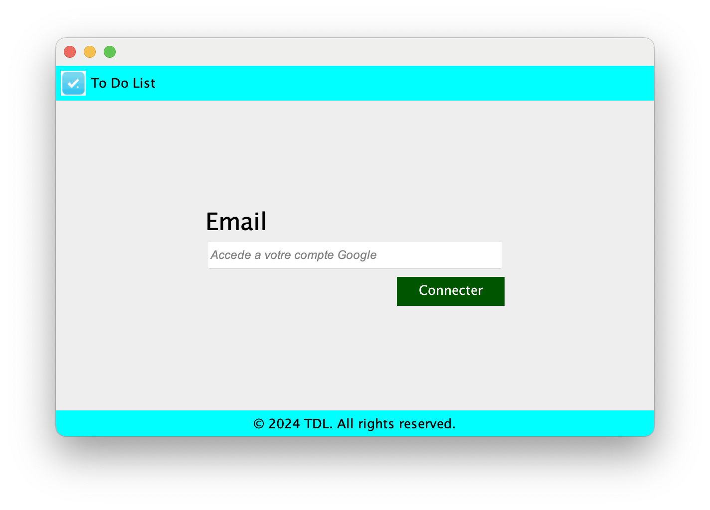
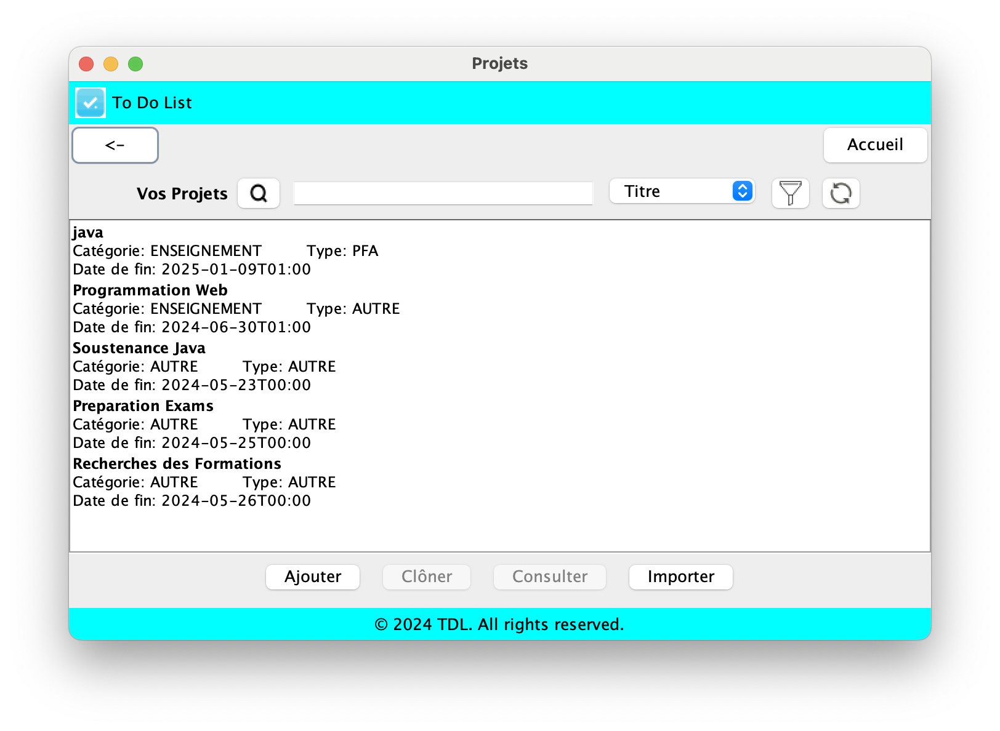
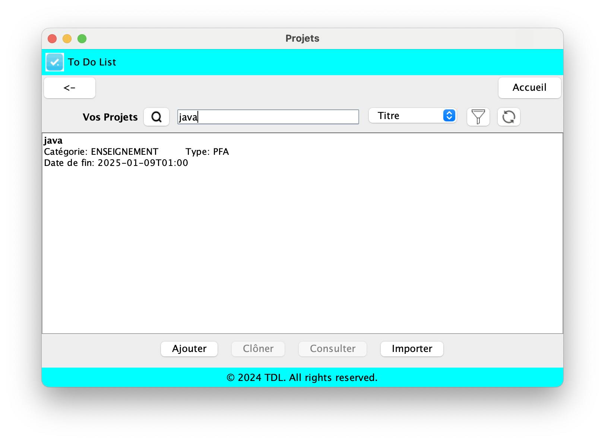
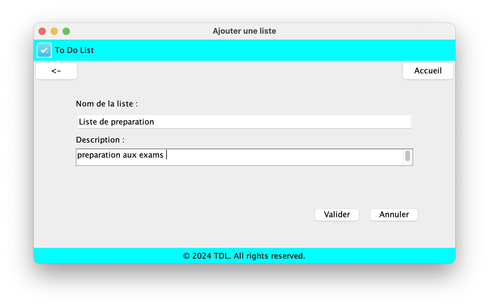
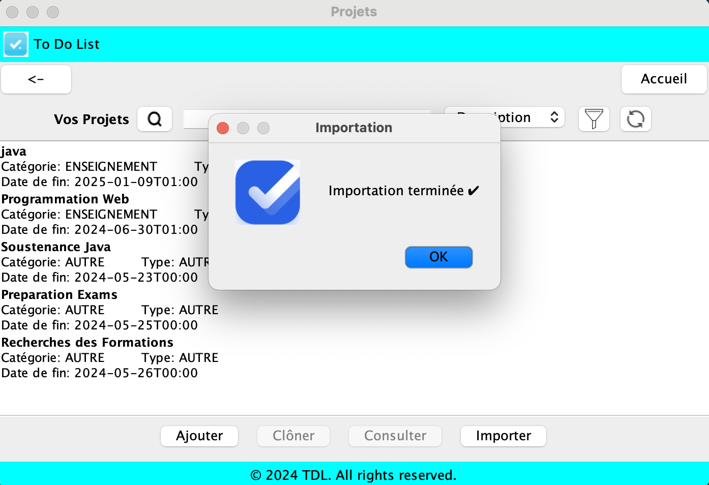
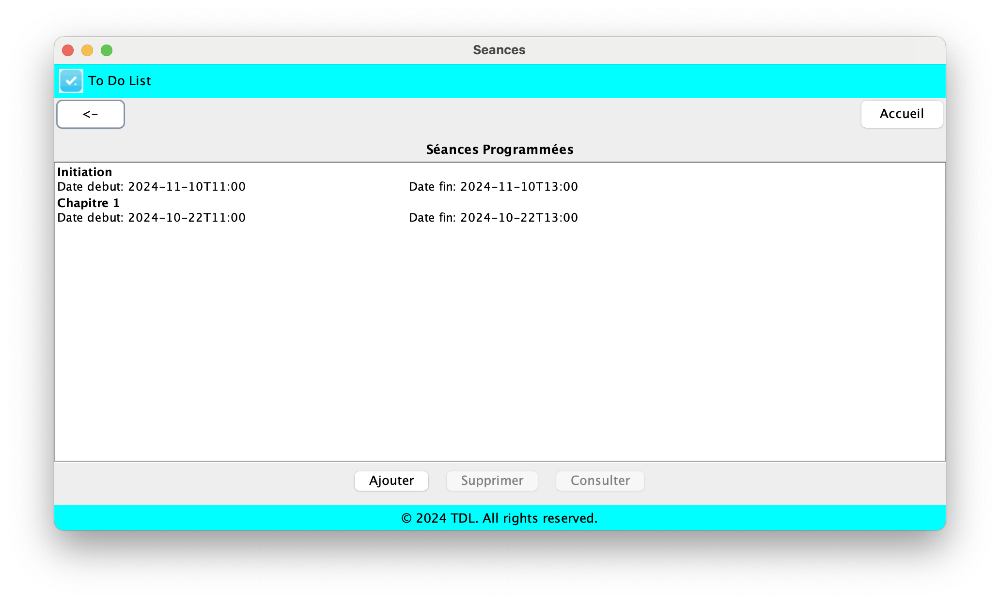
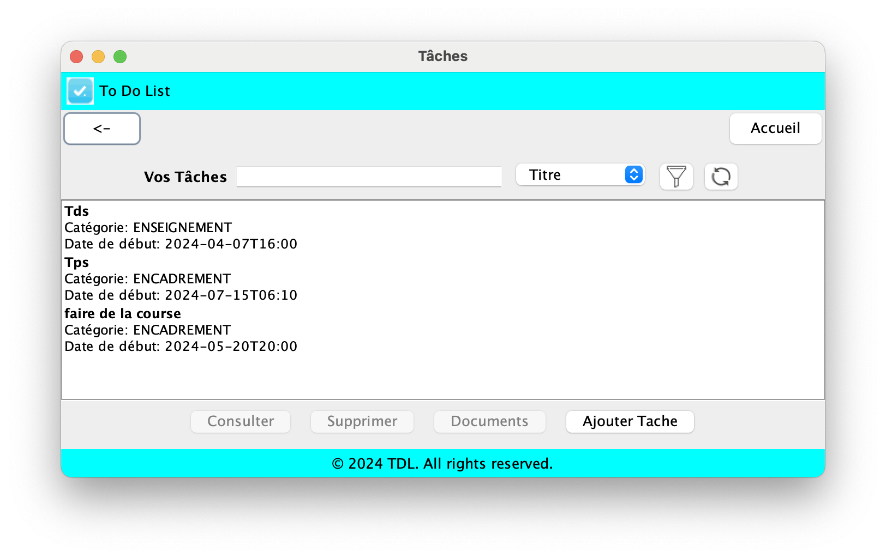
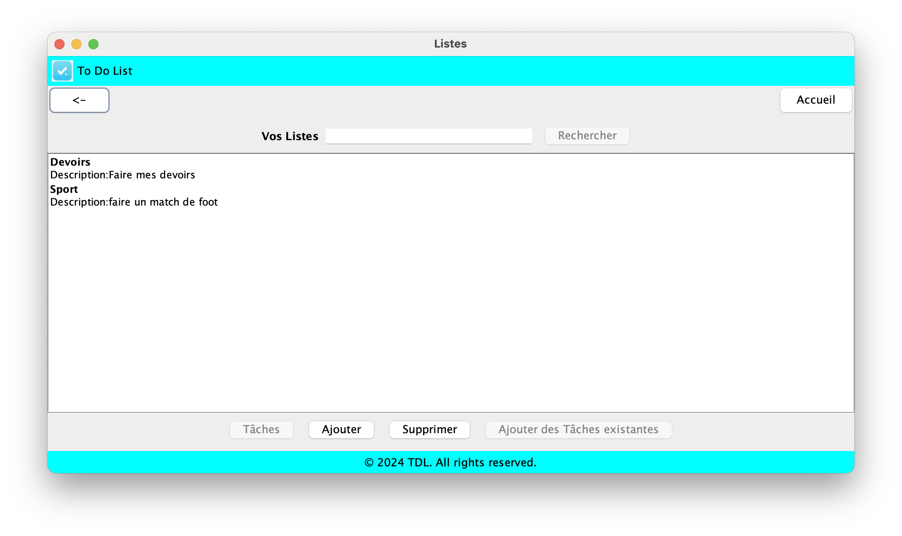

# Application de Gestion des Projets et Tâches Académiques

    

## Concept Fondateur d'Application
TDL est une application conçue pour aider les professeurs à gérer leurs projets et tâches académiques. Elle permet l'organisation et le suivi des activités liées à l'enseignement, la recherche et l'encadrement, en fournissant une interface intuitive pour gérer les projets, les tâches, et les séances de travail.

## Fonctionnalités
- **Authentification Utilisateur:** Connexion via un email Google.
- **Gestion des Projets:**
  - Créer, lister, filtrer, rechercher et cloner des projets.
  - Ajouter, clôturer, modifier les informations d’un projet.
  - Importer des séances de Google Calendar et les associer à des projets.
- **Gestion des Tâches:**
  - Créer, lister, filtrer, rechercher et cloner des tâches.
  - Attacher des tâches à des projets.
  - Importer des tâches de Google Calendar.
- **Gestion des Séances de Travail:**
  - Ajouter des séances de travail à des projets avec description, date de début et date de fin.
  - Attacher des notes et des documents à des séances de travail.
- **Gestion des Documents:**
  - Attacher des documents aux projets et aux séances de travail.
  - Rechercher des documents par mots-clés.
- **Statistiques:**
  - Suivi des heures de travail par projet.
  - Nombre de documents par projet.
  - Suivi des heures de travail par semaine, mois, et année.
  - Pourcentage des heures de travail par catégorie et type.

## Quelques Aperçu Graphique de l'Application

### Authentification

### Projets

### Recherche

### Importation des tâches depuis Google Calendar

### Formulaire d'ajout d'une liste

### Séances

### Tâches

### Listes

## Outils Utilisés
- **Langage de Programmation:** Java
- **Interface Graphique:** Swing
- **Base de Données:** MongoDB
- **Intégration avec Google Calendar**
- **Stockage des Paramètres de Configuration:** Fichier de propriétés

## Conclusion
Cette application de gestion des projets et tâches académiques offre une solution complète et flexible pour les professeurs. En utilisant des technologies robustes comme Java, Swing et MongoDB, elle permet une gestion efficace et intuitive des tâches académiques, tout en intégrant des outils modernes comme Google Calendar. La modularité et les fonctionnalités avancées de cette application en font un outil précieux pour l'organisation quotidienne des activités académiques.

Nous espérons que cette application répondra aux attentes et facilitera grandement la gestion des projets académiques. Toute suggestion ou amélioration est la bienvenue pour continuer à développer et perfectionner cet outil.
